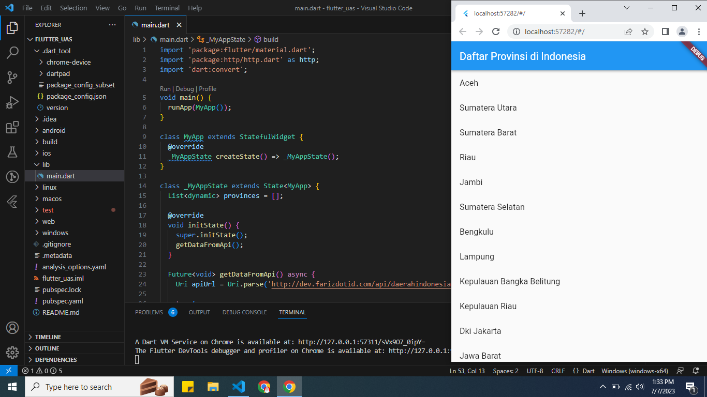

# flutter_uas
## Profil
|        #        | Biodata           |
| --------------- | ----------------- |
| **Nama**        | D.Wita Aeni       |
| **NIM**         | 312110222         |
| **Kelas**       | TI.21.A.1         |
| **Mata Kuliah** | Pemrograman Web 2 |

## Membuat Tampilan List API dengan Menggunakan Flutter

Program ini dibuat untuk menampilkan daftar nama Daerah di Indonesia. Data API bisa dilihat di link berikut [Nama Daerah di Indonesia](http://dev.farizdotid.com/api/daerahindonesia/provinsi). Berikut merupakan source code untuk **main.dart**:

```dart
import 'package:flutter/material.dart';
import 'package:http/http.dart' as http;
import 'dart:convert';

void main() {
  runApp(MyApp());
}

class MyApp extends StatefulWidget {
  @override
  _MyAppState createState() => _MyAppState();
}

class _MyAppState extends State<MyApp> {
  List<dynamic> provinces = [];

  @override
  void initState() {
    super.initState();
    getDataFromApi();
  }

  Future<void> getDataFromApi() async {
    Uri apiUrl = Uri.parse('http://dev.farizdotid.com/api/daerahindonesia/provinsi');

    try {
      final response = await http.get(apiUrl);
      if (response.statusCode == 200) {
        setState(() {
          provinces = json.decode(response.body)['provinsi'];
        });
      } else {
        print('Failed to load data from API');
      }
    } catch (e) {
      print('Error: $e');
    }
  }

  @override
  Widget build(BuildContext context) {
    return MaterialApp(
      home: Scaffold(
        appBar: AppBar(
          title: Text('Daftar Provinsi di Indonesia'),
        ),
        body: ListView.builder(
          itemCount: provinces.length,
          itemBuilder: (context, index) {
            return ListTile(
              title: Text(provinces[index]['nama']),
            );
          },
        ),
      ),
    );
  }
}
```

* Setelah membuat source code pada **main.dart**, lalu tambahkan package http pada **pubspec.yaml** seperti berikut:

```dart
dependencies:
  flutter:
    sdk: flutter
  http: ^0.13.3
```
* Lalu jalankan perintah **flutter pub get** di terminal, perintah ini digunakan untuk mengambil semua paket (dependencies) yang didefinisikan dalam file **pubspec.yaml** dan mengunduhnya ke dalam project yang kita buat. Setelah semua paket berhasil diunduh, jalankan perintah **flutter run**.

## Tampilan Output


## Terima Kasih
